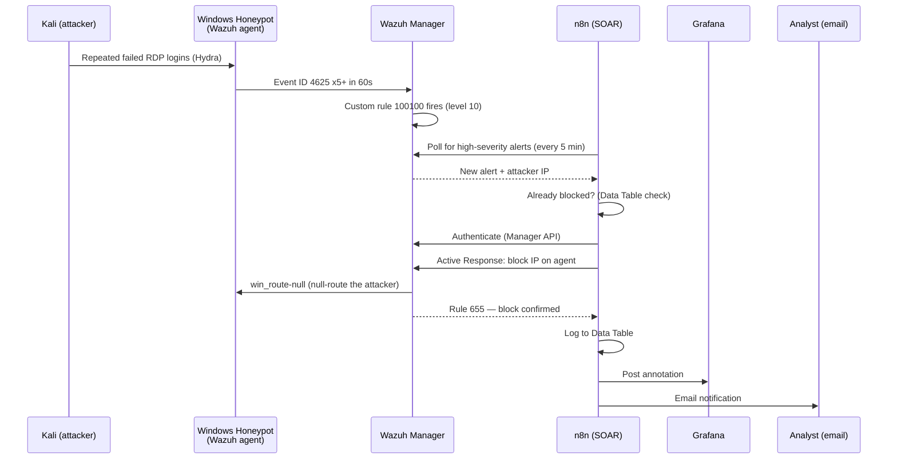

# Autonomous SOC

A working, self-hosted Security Operations Center that detects an RDP brute-force attack against a Windows honeypot and automatically contains it — no human in the loop for detection, decision, or response.

**Status: live-tested and verified.** Every claim below is backed by a real artifact in [`evidence/`](evidence/) — not a simulation, not a screenshot of intent. The attack, the detection, and the automated block all genuinely happened.

## What it does

| Stage | Component | Role |
|---|---|---|
| Attack | Kali Linux | `hydra` brute-forces RDP against the honeypot |
| Detection | Wazuh agent (Windows) | Forwards Security event log (Event ID 4625) |
| Correlation | Wazuh Manager | Custom rule `100100`: 5+ failures / 60s / same source IP → level 10 |
| Orchestration | n8n | Polls Wazuh, dedupes, authenticates, triggers the block, logs everywhere |
| Containment | Wazuh Active Response | `win_route-null` — null-routes the attacker IP on the honeypot itself |
| Visibility | Grafana | Dashboard of every auto-block action |
| Notification | Gmail SMTP | Email alert per incident |

## Real proof, not a demo

Every file in [`evidence/`](evidence/) was pulled directly from the running system's own APIs, same day, after a real attack:

- **[`real_brute_force_alert.json`](evidence/real_brute_force_alert.json)** — Wazuh's actual alert record: rule `100100`, level 10, attacker IP extracted from the Windows Security event
- **[`real_active_response_ack.json`](evidence/real_active_response_ack.json)** — Wazuh's own acknowledgment that the block genuinely executed on the agent (rule `655`, *"Host Blocked by route-null Active Response"*) — not just an API call returning 200, an independent confirmation from Wazuh itself
- **[`real_blocked_ip_data_table.json`](evidence/real_blocked_ip_data_table.json)** — n8n's record of the block, including the exact timestamp
- **[`wazuh_rule_100100.xml`](evidence/wazuh_rule_100100.xml)** — the actual custom detection rule running on the manager
- **[`wazuh_active_response_config.txt`](evidence/wazuh_active_response_config.txt)** — the Active Response policy that makes the block possible
- **[`n8n_auto_block_workflow.json`](evidence/n8n_auto_block_workflow.json)** — the full exported workflow (credentials referenced by name only — no secrets included)
- **[`grafana_dashboard.json`](evidence/grafana_dashboard.json)** — the dashboard definition used to visualize every block

Screenshots of the live system, taken during the actual test session, in [`evidence/screenshots/`](evidence/screenshots/):

- **[`wazuh_dashboard_brute_force_spike.png`](evidence/screenshots/wazuh_dashboard_brute_force_spike.png)** — the Wazuh dashboard showing the real detection spike (level 10) and MITRE ATT&CK breakdown including Brute Force / Remote Desktop Protocol
- **[`n8n_workflow_canvas.png`](evidence/screenshots/n8n_workflow_canvas.png)** — the full Auto-Block workflow, every node visible, Detect → Trigger → Decide → Block → Log → Notify
- **[`n8n_execution_history.png`](evidence/screenshots/n8n_execution_history.png)** — real execution history showing successful runs
- **[`honeypot_windows_identity.png`](evidence/screenshots/honeypot_windows_identity.png)** — the Windows honeypot (`WIN-KU9NOAE1FE4`) being defended

## How it was actually built

This wasn't a clean first try. **[`Troubleshooting_Log.md`](Troubleshooting_Log.md)** documents all twelve real failures hit while wiring this together — from a Claude Desktop connector quirk to a live Wazuh outage caused by a file-permissions mistake mid-session — each with a plain-English explanation, the technical root cause, and how it was actually fixed. It's written to be useful on its own, independent of this specific stack.

A polished, dual-depth (plain-English + technical) version of the same log, with an interactive architecture diagram, is also kept at **[`postmortem/Autonomous_SOC_Postmortem.html`](postmortem/Autonomous_SOC_Postmortem.html)**.

## Presentation materials

**[`slides/`](slides/)** — ready-to-present HTML/PNG slide decks covering the n8n↔Wazuh and n8n↔Grafana wiring, plus a Week 2 review deck.

**[`presentations/`](presentations/)** — full Keynote/PowerPoint decks: `Autonomous_SOC_v4` and `SOC_Capstone_Final`.

## Reproducing this on a new machine

Cloning this repo gets you the evidence, the exact rule/workflow/dashboard definitions, and the writeup — **not** a one-command working environment. Here's honestly what that takes:

**✅ Fully included in this repo, ready to reuse:**
- The n8n workflow (`evidence/n8n_auto_block_workflow.json`) — import directly into any n8n instance
- The Wazuh detection rule and Active Response config (`evidence/wazuh_rule_100100.xml`, `evidence/wazuh_active_response_config.txt`) — drop into Wazuh's `local_rules.xml` / `ossec.conf`
- The Grafana dashboard (`evidence/grafana_dashboard.json`) — import via Grafana's dashboard import screen
- `deployment/docker-compose.yml` + `.env.example` — sanitized compose file for n8n + Grafana (no real passwords — copy `.env.example` to `.env` and fill in your own)

**❌ Deliberately not included (needs separate setup):**
1. **Wazuh itself** — built from the official [`wazuh/wazuh-docker`](https://github.com/wazuh/wazuh-docker) repo, `v4.14.5`, single-node deployment. Clone that repo separately and follow its own setup instructions; it's not vendored here since it's a large third-party project with its own release cycle.
2. **Credentials** — the 4 n8n credentials (Wazuh Indexer, Wazuh Manager API, Grafana API Token, Gmail SMTP) are never exported with real secrets, by design. See `Troubleshooting_Log.md` issue #10 for exactly how to find your own deployment's actual Wazuh passwords (they're not the defaults).
3. **The Windows honeypot and Kali attacker VMs** — these are multi-gigabyte UTM virtual machine images, entirely outside what git/GitHub is built for. They live only on the machine they were built on; moving them to a new laptop means exporting/copying the actual `.utm` bundles directly (e.g. via an external drive), not via this repo.

**Setup order, roughly:** Wazuh (wazuh-docker single-node) → `docker compose up` this repo's n8n+Grafana stack → import the workflow JSON into n8n → recreate the 4 credentials → import the dashboard JSON into Grafana → copy in the rule/Active Response config and restart Wazuh → separately restore the honeypot/Kali VMs if needed.

## Known gaps (honest, not hidden)

- The 5-minute polling schedule means detection-to-block has up to a 5-minute lag by design — not instant.
- Active Response uses `win_route-null` (a null route), which blackholes traffic — it does not add a visible Windows Firewall rule, so verification requires `route print` on the honeypot, not the Firewall UI.
- This defends one honeypot agent; extending to multiple agents means updating the Active Response policy's `agent_id` scoping.

## Stack

Docker Desktop · Wazuh 4.14 (Manager, Indexer, Dashboard) · n8n · Grafana · Kali Linux (Hydra) · Windows 11 honeypot (UTM VM) · Claude Code
